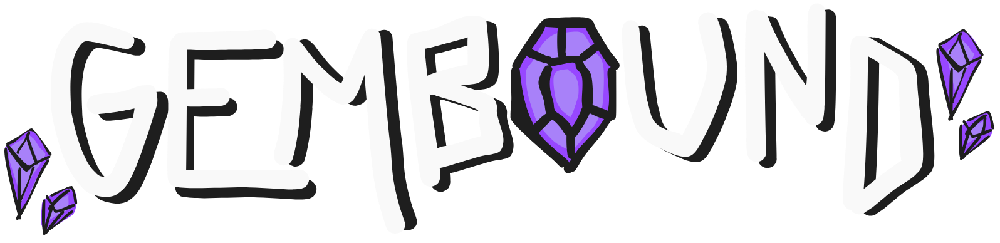
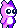
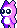

#  Game Development Team: UHM-GameGPT 
* Iverson Yago
* Juan Olivo
* Keiko Raiola
* Samantha Limon
* Susan Ma

#  Game Pitch 
Gembound is a 2D platformer game. The player navigates a world where the cosmic balance has been shattered. The player collects special gems throughout the time and space levels, with each gem granting a unique ability. The player must master these abilities to overcome obstacles, solve puzzles, and reach previously inaccessible areas containing additional gems. At the end of each level, the player must face a challenging mini-boss that tests their mastery of the collected abilities. The adventure culminates in an epic confrontation with a final boss that requires strategic use of all acquired powers.

#  Video Trailer 

#  Further Developments 
At the end of Gembound, a new threat emerges. This insidious phenomenon begins draining color from the world, transforming vibrant landscapes into monochrome wastelands. With each passing moment, not only is color fading from the universe, but joy, hope, and emotion are being siphoned away as well. The inhabitants of once-lively regions now wander as gray, emotionless husks, their spirits dimmed by the encroaching void
